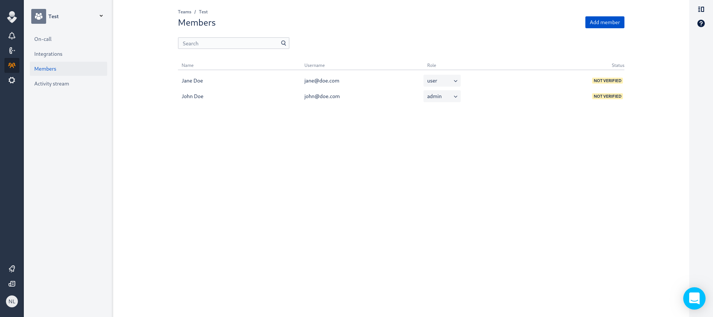
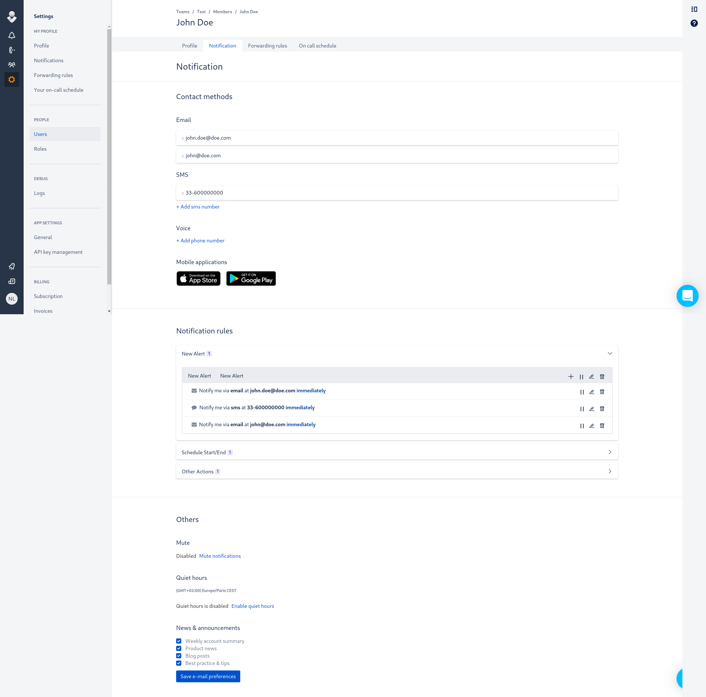
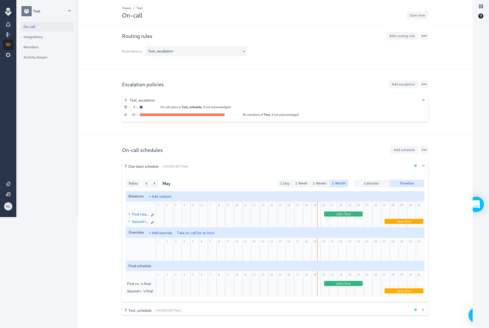

Terraform Provider
==================

- Website: https://www.terraform.io
- [](https://gitter.im/hashicorp-terraform/Lobby)
- Mailing list: [Google Groups](http://groups.google.com/group/terraform-tool)


Usage
-------

```
provider "opsgenie" {
  api_key = "${var.api_key}"
}

resource "opsgenie_user" "first" {
  username  = "john@doe.com"
  full_name = "John Doe"
  role      = "admin"
  locale    = "fr_FR"
  timezone  = "Europe/Paris"
}

resource "opsgenie_user" "second" {
  username  = "jane@doe.com"
  full_name = "Jane Doe"
  role      = "user"
  locale    = "fr_FR"
  timezone  = "Europe/Paris"
}

resource "opsgenie_team" "team_test" {
  name        = "Test"
  description = "This team deals with all the things"

  member {
    username = "${opsgenie_user.first.username}"
    role     = "admin"
  }

  member {
    username = "${opsgenie_user.second.username}"
    role     = "user"
  }
}

resource "opsgenie_contact" "first_contact_email" {
  username = "${opsgenie_user.first.username}"
  to       = "john.doe@doe.com"
  method   = "email"
}

resource "opsgenie_contact" "first_contact_sms" {
  username = "${opsgenie_user.first.username}"
  to       = "33-600000000"
  method   = "sms"
}

resource "opsgenie_schedule" "schedule_doe_ops" {
  name        = "Doe Schedule"
  description = "The schedule for the Doe team"
  owner       = "${opsgenie_team.team_test.name}"
  timezone    = "Europe/Paris"

  rotation = {
    name       = "First rotation"
    start_date = "2019-05-20T08:00:00Z"
    end_date   = "2019-05-24T19:00:00Z"
    type       = "daily"

    participant {
      type     = "user"
      username = "${opsgenie_user.first.username}"
    }
  }

  rotation = {
    name       = "Second rotation"
    start_date = "2019-05-27T08:00:00Z"
    end_date   = "2019-05-31T19:00:00Z"
    type       = "daily"

    participant {
      type     = "user"
      username = "${opsgenie_user.second.username}"
    }
  }
}

```





Requirements
------------

-	[Terraform](https://www.terraform.io/downloads.html) 0.10.x
-	[Go](https://golang.org/doc/install) 1.8 (to build the provider plugin)

Building The Provider
---------------------

Clone repository to: `$GOPATH/src/github.com/terraform-providers/terraform-provider-opsgenie`

```sh
$ mkdir -p $GOPATH/src/github.com/terraform-providers; cd $GOPATH/src/github.com/terraform-providers
$ git clone git@github.com:terraform-providers/terraform-provider-opsgenie
```

Enter the provider directory and build the provider

```sh
$ cd $GOPATH/src/github.com/terraform-providers/terraform-provider-opsgenie
$ make build
```


Using the provider
----------------------
## Fill in for each provider

Developing the Provider
---------------------------

If you wish to work on the provider, you'll first need [Go](http://www.golang.org) installed on your machine (version 1.8+ is *required*). You'll also need to correctly setup a [GOPATH](http://golang.org/doc/code.html#GOPATH), as well as adding `$GOPATH/bin` to your `$PATH`.

To compile the provider, run `make build`. This will build the provider and put the provider binary in the `$GOPATH/bin` directory.

```sh
$ make bin
...
$ $GOPATH/bin/terraform-provider-opsgenie
...
```

In order to test the provider, you can simply run `make test`.

```sh
$ make test
```

In order to run the full suite of Acceptance tests, run `make testacc`.

*Note:* Acceptance tests create real resources, and often cost money to run.

```sh
$ make testacc
```
